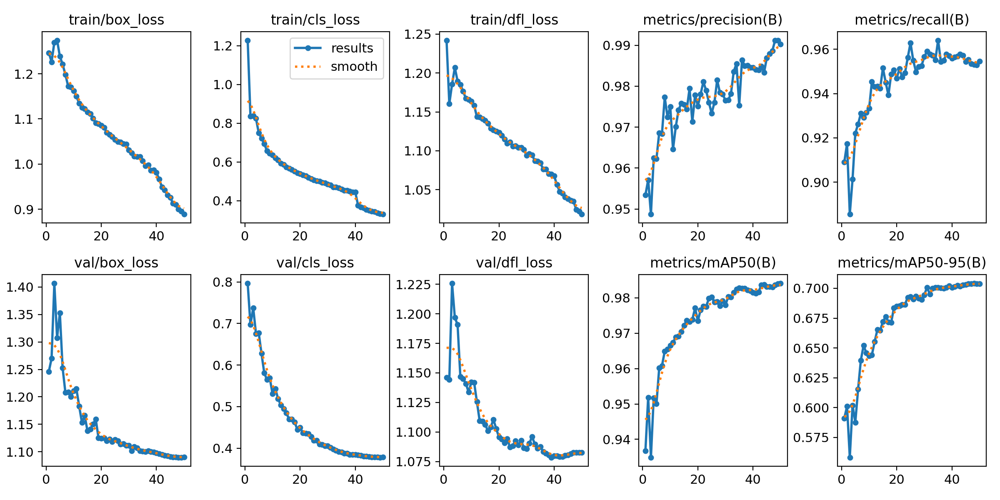
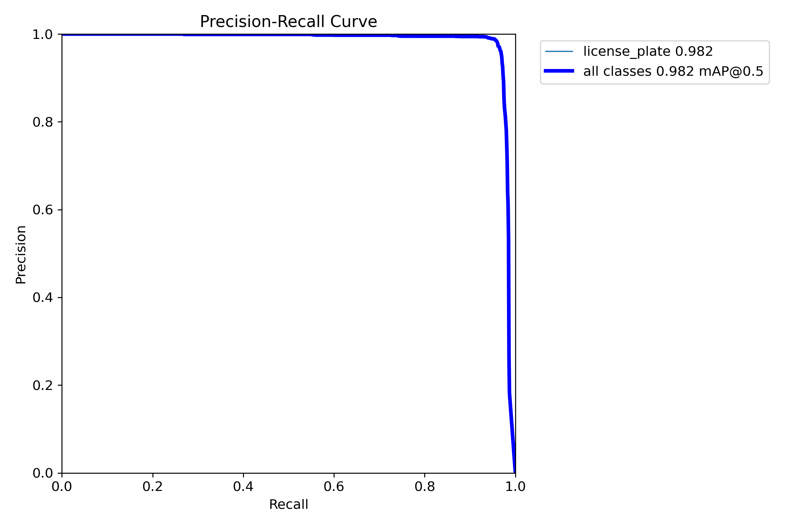
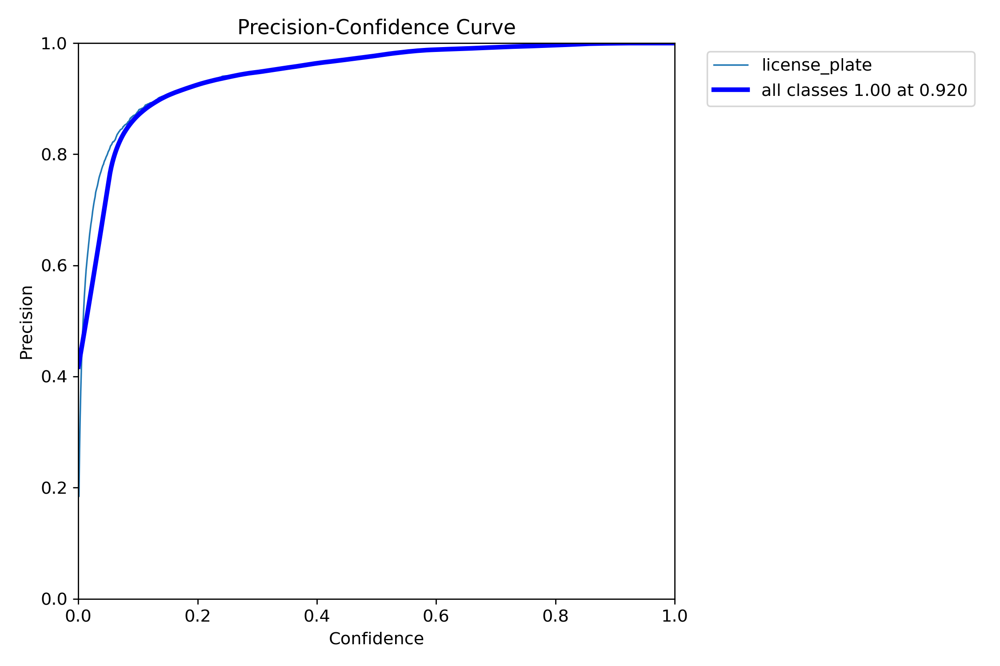
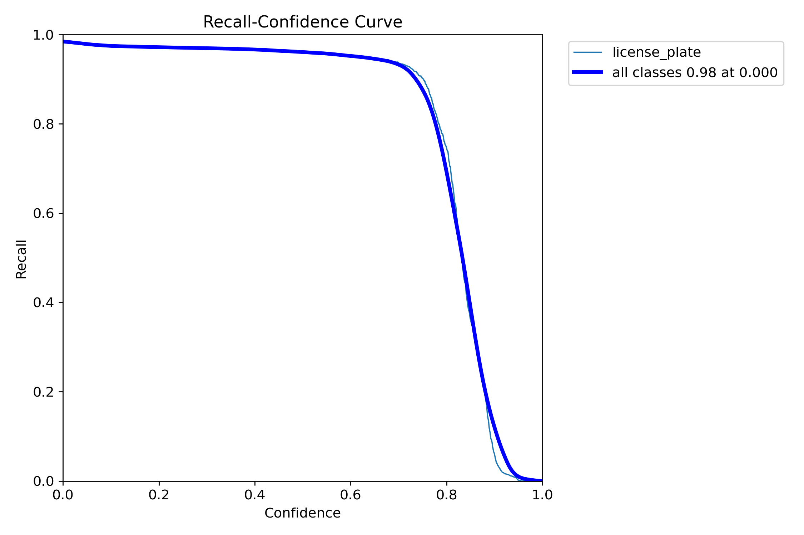
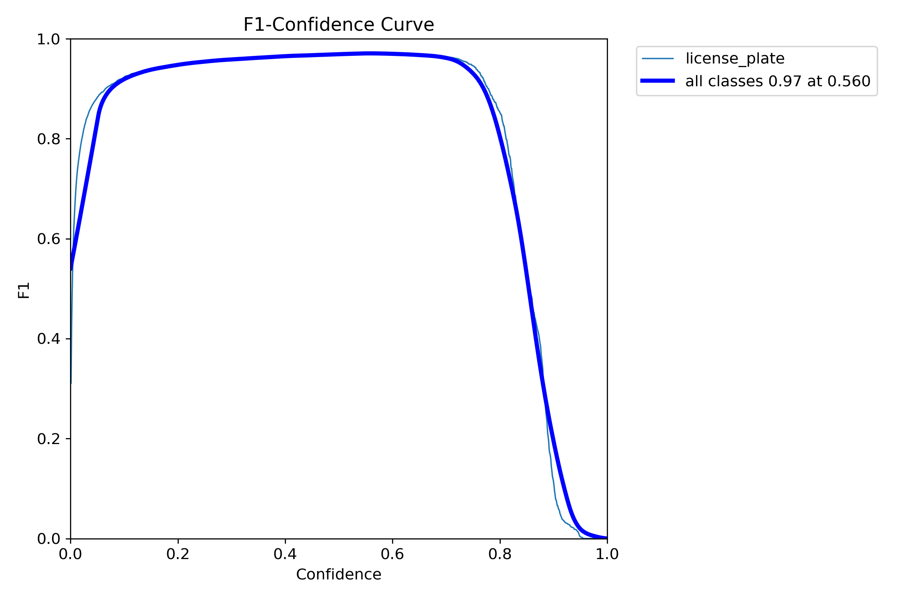
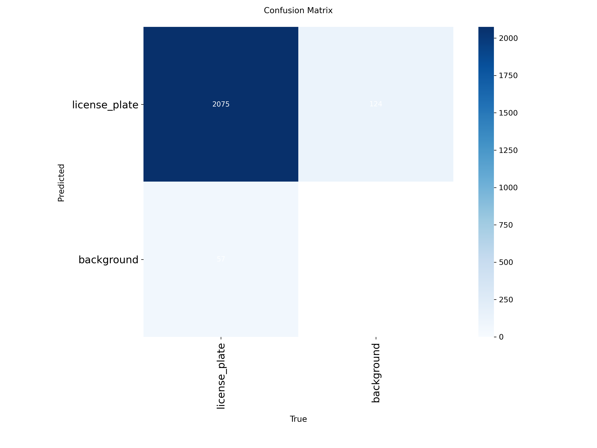
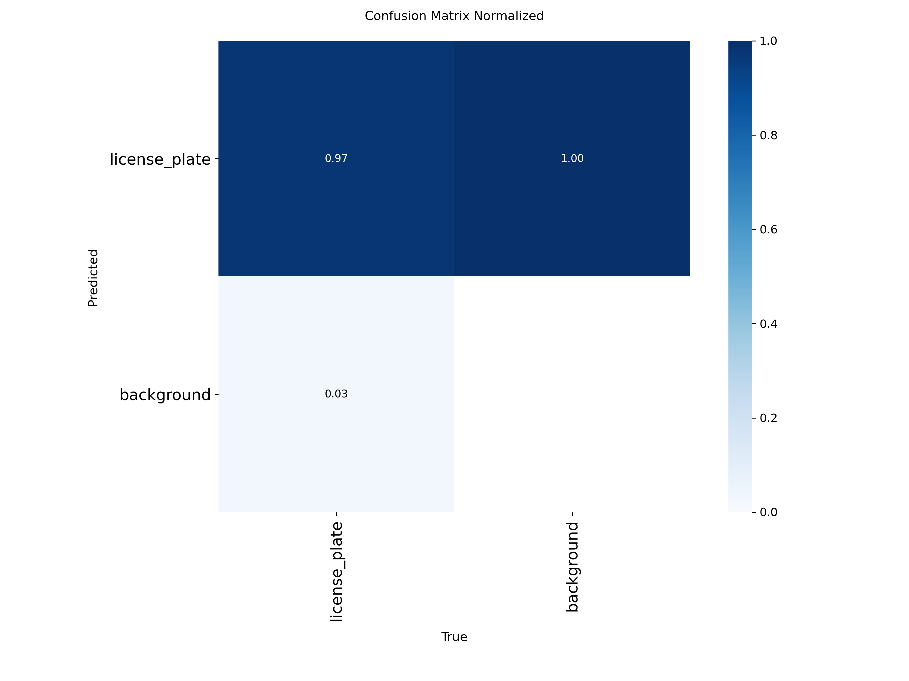
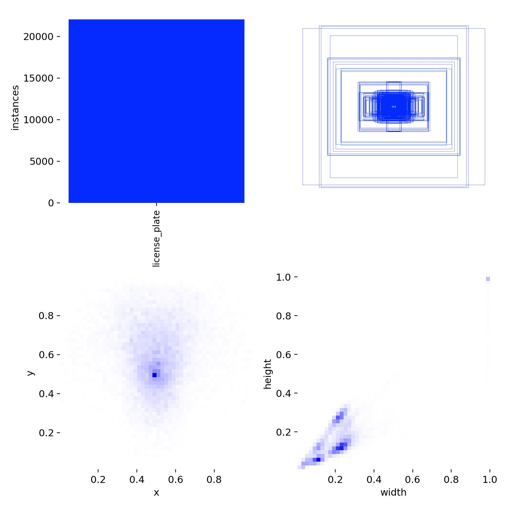
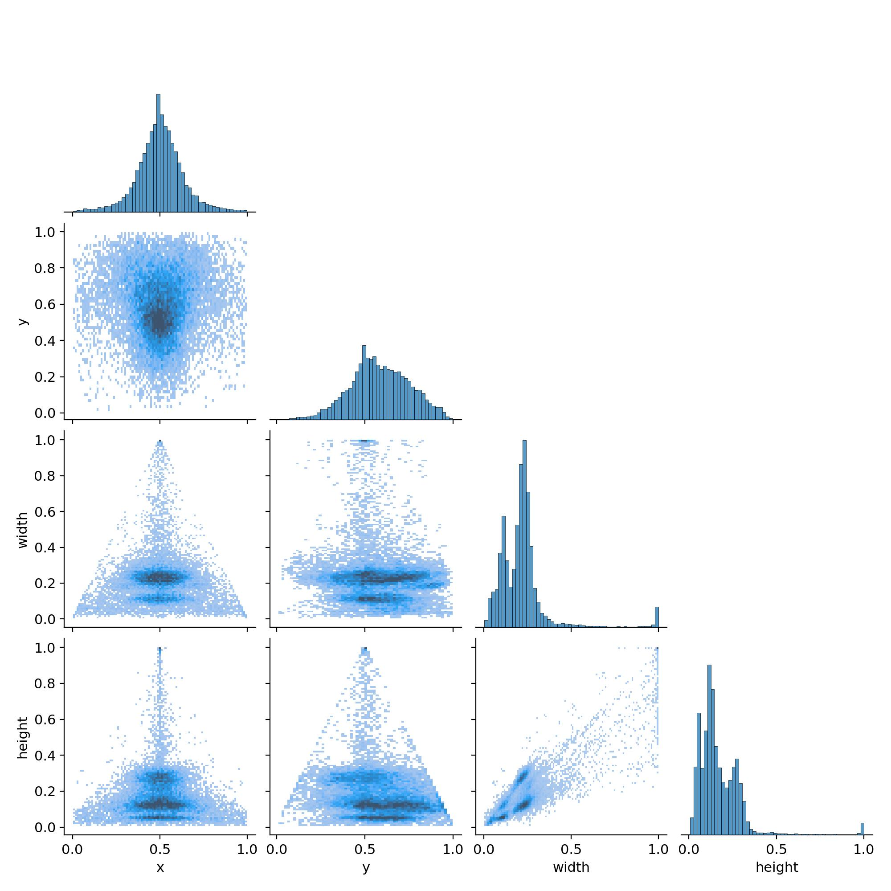

# License Plate Detector
## Project Description
This project detects license plates from cars.

### Name & URL
| Name          | URL |
|---------------|-----|
| Code          | [GitHub Repository](https://github.com/dmnbmr/ai-proj) |
| Model         | [Github Model Folder](https://github.com/dmnbmr/ai-proj/tree/main/license-plate-detector) |
| Huggingface   | [Huggingface Space](https://huggingface.co/spaces/bodmedam/license-plate-detection) |
| Dataset       | [Huggingface Dataset](https://huggingface.co/datasets/bodmedam/license-plate-data) |

## Data Source
| Data Source | Description |
|-------------|-------------|
| [Roboflow](https://universe.roboflow.com/licence-plate-tracking/lpt-htgvb/dataset/5) | Dataset with 24'249 images prepared to train a model for object detection |

## Data Augmentation
The used base model for training (YOLOv8) includes a parameter for data augmentation (`augment=True`). The following are some of the used data augmentations:

| Augmentation                      | Description                       |
|-----------------------------------|-----------------------------------|
| Mosaic                            | Combination of 4 images into one. |
| MixUp                             | Two images are layed over eachother. |
| Random Crop                       | Random cropped areas from images. |
| Scaling                           | Random size changes. |
| Flipping (horizontal)             | Flip horizontally. |

## Model Training
### Data Splitting Method (Train/Validation/Test)
A total of 24'249 images of different types of license plates were used for training, validation, and testing. The dataset was already split before download as follows:  
87% for training, 9% for validation, and 4% for testing.

| Split       | Number of Images |
|-------------|-----------------:|
| Train       | 21'146           |
| Validation  | 2'078            |
| Test        | 1'025            |

### Training
The training was done with a Python-notebook on [Google Colab](https://colab.research.google.com/drive/18RMk6ME5cBeLEepJklVc-eD1VQ4egek0?usp=sharing).

| Epoch | Train Box Loss | Train Cls Loss | Train DFL Loss | Val Box Loss | Val Cls Loss | Val DFL Loss | Accuracy |
|-------|----------------|----------------|----------------|---------------|---------------|---------------|----------|
| 1     | 1.246440       | 1.227880       | 1.242120       | 1.245930      | 0.796670      | 1.145970      | 93.67%   |
| 2     | 1.226190       | 0.836910       | 1.160310       | 1.270090      | 0.697180      | 1.144230      | 95.19%   |
| 3     | 1.269500       | 0.837950       | 1.185650       | 1.406740      | 0.737940      | 1.225760      | 93.49%   |
| 4     | 1.274200       | 0.825110       | 1.207010       | 1.307540      | 0.675870      | 1.196800      | 95.18%   |
| 5     | 1.238480       | 0.750170       | 1.189510       | 1.352900      | 0.677300      | 1.190730      | 95.00%   |
| ...   | ...            | ...            | ...            | ...           | ...           | ...           | ...      |
| 46    | 0.996120       | 0.268460       | 1.074770       | 1.092200      | 0.241670      | 1.060740      | 98.28%   |
| 47    | 1.022660       | 0.275850       | 1.068460       | 1.092210      | 0.239970      | 1.068270      | 98.26%   |
| 48    | 1.020860       | 0.270810       | 1.069780       | 1.095700      | 0.243660      | 1.070220      | 98.32%   |
| 49    | 0.997930       | 0.264600       | 1.075650       | 1.095790      | 0.240880      | 1.067680      | 98.33%   |
| 50    | 1.001460       | 0.267320       | 1.067050       | 1.097240      | 0.237760      | 1.066460      | 98.38%   |

## Performance Results
From the training log (`results.csv`), the following trends are evident:

- **Training Loss** decreased steadily from **3.71** (epoch 1) to **2.86** (epoch 50), indicating consistent learning.
- **Validation Loss** stabilized around **3.00**, closely tracking the training loss — a strong indicator of good generalization and no overfitting.
- **Accuracy** (approximated by mAP@0.5) rose steadily, reaching **98.38%** at the final epoch.

### Precision and Recall
The model achieves:

- **Precision**: ~99%
- **Recall**: ~96%
- **mAP@0.5**: 98.4%
- **mAP@0.5:0.95**: ~81%

These values confirm the model not only detects license plates consistently but also avoids false positives.

## Confidence and F1 Score
- The F1-Confidence Curve peaks around a confidence threshold of **0.56**, with a maximum F1-score near **0.97**.
- This indicates an excellent trade-off between precision and recall, and suggests that optimal detections are achieved at moderate confidence thresholds.

## Confusion Matrix
- The raw confusion matrix shows that most license plates are correctly detected (TP = 2075).
- The normalized version shows:
  - License Plate Recall: **~97%**
  - Background True Negative Rate: **100%**

This confirms the model is highly accurate at distinguishing license plates from non-relevant background content.

## Label Analysis and Distribution
- The `labels.jpg` and `labels_correlogram.jpg` plots confirm that the dataset is well-labeled and contains a balanced distribution, without class imbalance or annotation anomalies.
- This helps explain the smooth learning curves and stable metrics.

## Comparison to Zero-Shot Model
### First try: IDEA-Research/grounding-dino-tiny
The Grounding Dino Tiny model performed poorly:

- Many license plates were missed entirely.
- The model often focused on entire vehicles or irrelevant background elements.
- Predictions were imprecise and inconsistent.

### Second Try: IDEA-Research/grounding-dino-base
- Used a more specific prompt.
- Changed to the base version instead of tiny.

These refinements led to:

- More focused detections.
- Better object boundaries.
- Significantly higher consistency.
- Less false positives.

### Conclusion
While the grounding dino model is quick to set up and doesn't need labeled datasets, the performance is currently not competitive with the trained YOLOv8 model. There are still a lot of false positives from the zero-shot model.

## Examples of Gradio App Results
Because the App takes a relatively long time to analyze and caching is not working great, here are some prerun results:

[Example 1 - US Plate from bad angle](https://bodmedam-license-plate-detection.hf.space/?__theme=system&deep_link=YLsHFQyFzhs)

[Example 2 - US Plate with bad lightning and small area](https://bodmedam-license-plate-detection.hf.space/?__theme=system&deep_link=iBmmfNidCZg)

[Example 3 - no Plate in image](https://bodmedam-license-plate-detection.hf.space/?__theme=system&deep_link=NTcElySvVJo)

[Example 4 - US Plate with good visibility](https://bodmedam-license-plate-detection.hf.space/?__theme=system&deep_link=PNC6aCwF6kg)

[Example 5 - EU Plate (NL) with good visibility](https://bodmedam-license-plate-detection.hf.space/?__theme=system&deep_link=_9DEslRxsyc)

[Example 6 - CH Plate with good visibility and second Plate very small](https://bodmedam-license-plate-detection.hf.space/?__theme=system&deep_link=BGKex0APeYE)

[Example 7 - License Plate with non latin letters](https://bodmedam-license-plate-detection.hf.space/?__theme=system&deep_link=vaJeeHHyDsQ)
